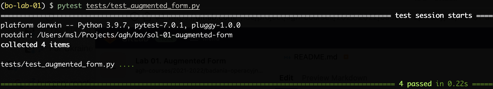

# Lab 01 - Linear Programming - Augmented Form

The goal of this is lab is to:

* fill missing code in the `saport.simplex.solver` class
* model all the assignments from the `assignment.pdf` in the corresponding functions of the `assignment.py` file

## SAPORT

SAPORT = Student's Attempt to Produce an Operation Research Toolkit

Refer to the `example.py` for a quick overview of the API.

The project depends on the fairly recent numpy distribution and Python interpreter (version >= `3.9` is recommended). All depedendencies are listed in `requirements.txt`. One can install them with simple `pip install -r requirements.txt`, but using a virtual environment (e.g. virtualenv) is encouraged ([official tutorial](https://docs.python.org/3/tutorial/venv.html)). 

## Local Tests

To test your solutions off-line, you can:
1) use tips from `assignment.py` comments about optimal solutions and solve your models with external solver (example on-line solver is available [here](https://online-optimizer.appspot.com/?model=builtin:default.mod))
2) run tests to check methods in from the `Solver` class, just run the `pytest` command in the project directory.
   The succesful run should look more or less like the screenshot below.

 

The off-line tests are desgined just to help you develop your solutions. They are very basic and **are not** used in the grading process.  

## GitLab Setup 

* [ ] Make sure, you have a **private** group 
  * [how to create a group](https://docs.gitlab.com/ee/user/group/#create-a-group)
* [ ] Add @bobot-is-a-bot as the new group member (role: **maintainer**)
  * [how to add a group member](https://docs.gitlab.com/ee/user/group/#add-users-to-a-group)
* [ ] Fork this project into your new **private** group
  * [how to create a fork](https://docs.gitlab.com/ee/user/project/repository/forking_workflow.html#creating-a-fork)

## How To Submit Solutions

* [ ] Clone repository: git clone:
    ```bash 
    git clone <repository url>
    ```
* [ ] Solve the exercises 
    * remember to change only files with `#TODO` comments
* [ ] Commit your changes
    ```bash
    git add <path to the changed files>
    git commit -m <commit message>
    ```
* [ ] Push changes to the gitlab master branch
    ```bash
    git push -u origin master
    ```

The rest will be taken care of automatically. You can check the `GRADE.md` file for your grade / test results. Be aware that it may take some time (up to one hour) till this file appears / gets updated.  

## Repository Guide

```bash
.
├── README.md        # this README
├── assignment.pdf   # pdf file with assignments to be modeled
├── assignment.py    # TODO: place to put the models of the assignments
├── conftest.py      # this file enables to call `pytest` without hustle
├── example.py       # just an example, how to create models in SAPORT
├── requirements.txt # package requirements - install with `pip -r requirements.txt`
├── saport           # directory with the SAPORT source-code   
│   └── simplex      # directory containing code related to the simplex algorithm 
│       ├── expressions        # directory with classes related to the linear programming model components 
│       │   ├── atom.py        # atom is just a single variable with a coefficient
│       │   ├── constraint.py  # class representing linear constraint
│       │   ├── expression.py  # class representing linear expression
│       │   └── objective.py   # class representing objective
│       ├── model.py    # class allowing to create linear programming models
│       ├── solution.py # class representing solutions to the problems
│       ├── solver.py   # TODO: this class will contain a simplex solver, you have to fill two methods here
│       └── tableaux.py # class representing so called simplex tableaux
├── test_screenshot.png # just a screenshot used in the README
└── tests               # directory with local tests
    ├── cases.py               # this file contains models used in the local tests
    └── test_augmented_form.py # this file contains local tests implemented using `pytest` library 
```

